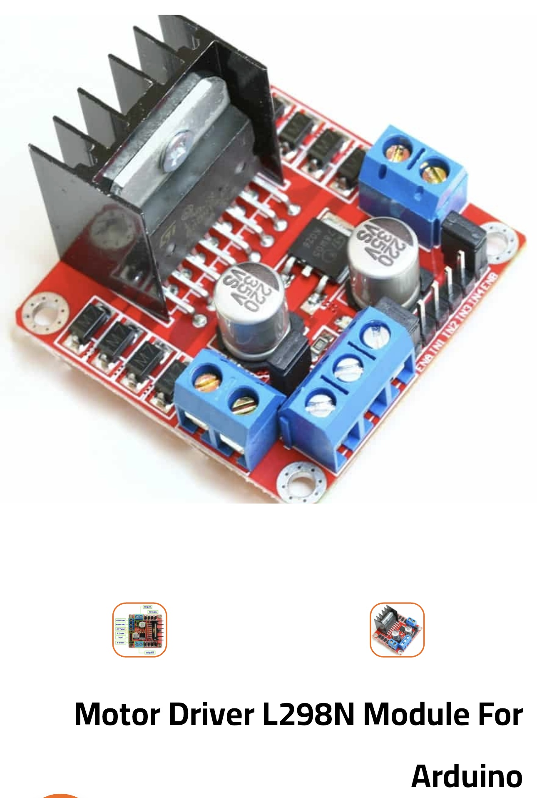

# Line-Follower
This repository contains the code for a 2wd black line follower Robot 

using the following components:

Arduino Uno Rev3

2x tcrt5000 sensor

Motor driver L298N Module for arduino

2x toy dc motors with wheels

2wd Robot chassis

Battery socket (3x18650)

3x Li-ion Battery 3.7v

This project was done by zorkano , ahmed4143 and ahmed-hassan

